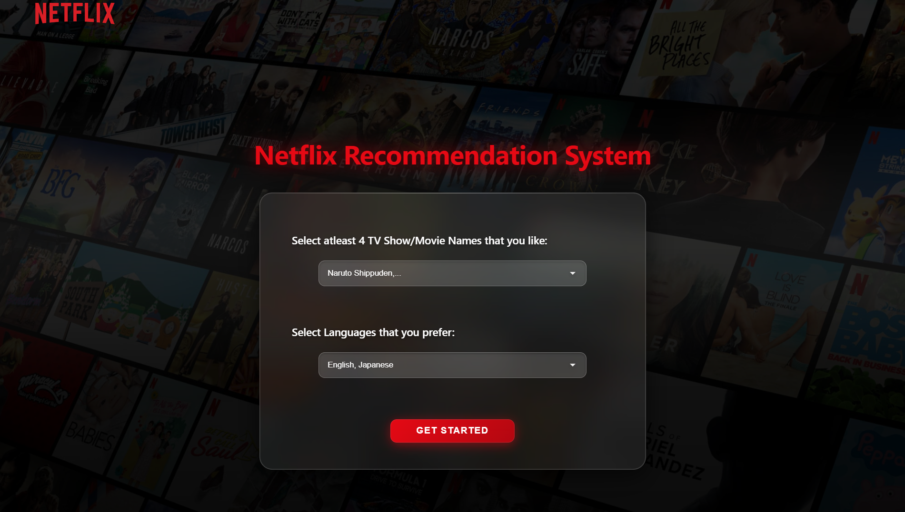
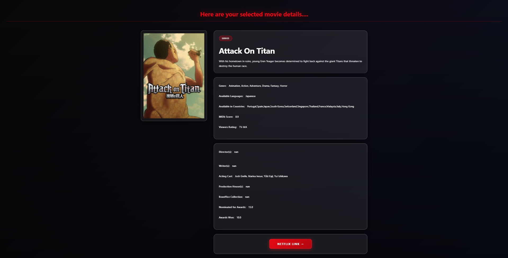

# 🎬 Entertainment Content Recommender

<div align="center">






**A smart recommendation system that suggests movies and series based on your favorites and language preferences**

[Getting Started](#-getting-started) • [Features](#-features) • [Demo](#-demo) • [Author](#-author)

</div>

---

## 📖 About

Entertainment Content Recommender is an intelligent web application that analyzes your favorite movies and series to suggest similar content tailored to your language preferences. Powered by machine learning algorithms, it provides personalized recommendations sorted by IMDb ratings.

### 💡 Inspiration

This project was inspired by the [Netflix Recommendation System](https://github.com/garg-priya-creator/Netflix-Recommendation-System) by [@garg-priya-creator](https://github.com/garg-priya-creator). We've expanded upon the original concept to create a more comprehensive entertainment recommendation platform with enhanced features and user experience.

## ✨ Features

### 🏠 **Home Page**
- Interactive interface to input your favorite movies or series
- Multi-language preference selection
- Smart content matching based on your inputs

**Example:**
> Input: *Insidious*, *Insidious Chapter 2*, *Supergirl*, *Suits*  
> Languages: *English*, *Hindi*  
> → Get personalized recommendations with similar genres and styles

### 🎯 **Recommendation Page**
- Visual display of recommended content with poster images
- Sorted by IMDb scores for quality assurance
- Click any poster to view detailed information

### 📄 **Movie Detail Page**
Comprehensive information including:
- 🎭 **Genre** classification
- 📝 **Plot Summary**
- 🌍 **Available Languages**
- ⭐ **IMDb Score**
- 👥 **Cast & Crew** (Directors, Writers, Actors)
- 🔗 **Direct Netflix Link** for streaming

### 🍿 **Netflix Integration**
- Seamless redirection to Netflix for direct streaming
- Quick access to watch recommended content

---

## 🚀 Getting Started

### Prerequisites

Ensure you have the following installed:
- [Git](https://git-scm.com/)
- [Python 3.x](https://www.python.org/downloads/)
- pip (Python package manager)

### Installation

1. **Clone the repository**
   ```bash
   git clone https://github.com/sahilkashyap263/Entertainment-Content-Recommender.git
   ```

2. **Navigate to the project directory**
   ```bash
   cd Entertainment-Content-Recommender
   ```

3. **Install required dependencies**
   ```bash
   pip install flask pandas scikit-learn
   ```

4. **Set up Flask environment**
   ```bash
   set FLASK_APP=app.py    # Windows
   export FLASK_APP=app.py # macOS/Linux
   ```

5. **Run the application**
   ```bash
   flask run
   ```

6. **Open your browser**
   
   Navigate to: `http://127.0.0.1:5000/`

---

## 🛠️ Tech Stack

| Technology | Purpose |
|------------|---------|
| **Python** | Backend logic |
| **Flask** | Web framework |
| **Pandas** | Data manipulation |
| **Scikit-learn** | Machine learning algorithms |
| **HTML/CSS** | Frontend structure and styling |
| **JavaScript** | Interactive features |

---

## 📸 Demo

```
Home Page → Enter Favorites → Get Recommendations → View Details → Stream on Netflix
```

---

## 🤝 Contributing

Contributions, issues, and feature requests are welcome!

1. Fork the project
2. Create your feature branch (`git checkout -b feature/AmazingFeature`)
3. Commit your changes (`git commit -m 'Add some AmazingFeature'`)
4. Push to the branch (`git push origin feature/AmazingFeature`)
5. Open a Pull Request

---

## 👥 Authors

<table>
<tr>
<td align="center">
<a href="https://github.com/sahilkashyap263">
<br />
<sub><b>Sahil Kashyap</b></sub>
</a><br />
<a href="https://linkedin.com/in/sahilkashyap263">💼 LinkedIn</a>
</td>
<td align="center">
<a href="https://github.com/vanshgautam7">
<br />
<sub><b>Vansh Pratap Gautam</b></sub>
</a><br />
<a href="https://github.com/vanshgautam7">🌐 GitHub</a>
</td>
<td align="center">
<a href="https://github.com/bakshi-harsh">
<br />
<sub><b>Harsh Bakshi</b></sub>
</a><br />
<a href="https://github.com/bakshi-harsh">🌐 GitHub</a>
</td>
<td align="center">
<a href="https://github.com/aniketverma031">
<br />
<sub><b>Aniket Verma</b></sub>
</a><br />
<a href="https://github.com/aniketverma031">🌐 GitHub</a>
</td>
</tr>
</table>

---

## 📝 License

This project is open source and available under the [MIT License](LICENSE).

---

## 💫 Show Your Support

Give a ⭐️ if you like this project!

---

<div align="center">

**Made with ❤️ by Sahil Kashyap, Vansh Pratap Gautam, Harsh Bakshi & Aniket Verma**

</div>